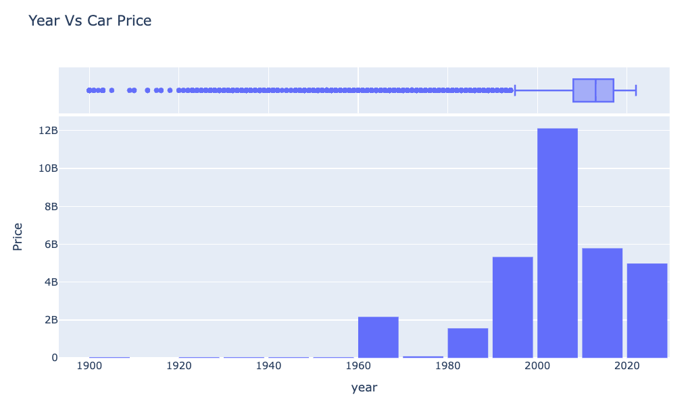

# Predict Used Car Price 

---

# Business Understanding 

## Objective

* Develop a model to accurately predict the prices of used cars, enabling a used car dealership to set competitive prices for their inventory.  

## Success Criteria

*  Minimize the difference between predicted and actual car prices. Identify the factors with the most significant influence on used car prices.  

# Data Understanding 

## Data Source

A dataset from Kaggle containing information on 426,000 used cars.
```
df \= pd.read\_csv('/content/drive/MyDrive/Berkeley/module\_11/vehicles.csv')  
df.info()
```

A quick overview of data:


## Key Features

The dataset includes features such as car `make`, `model`, `year`, `mileage` (`odometer`), `condition`, and `location`.

## Data Quality

The dataset contains missing values in several columns, including `'condition`', `'cylinders`', and `'size`'. Some columns, such as `'size'` (71.77% missing), were dropped due to a high percentage of missing values.  

 

## Exploratory Data Analysis (EDA)

### Year vs Price

* **Boxplot Insights**: Cars made after 2008 hold higher value.  
* Outliers exist for both very old and high-priced cars.

]

#### 

### Price Distribution

* Median price: \~$26.48K.  
* Some outliers exceed $3.7 billion, requiring filtering.


### Odometer vs Price

* Negative correlation: Higher odometer readings indicate lower prices.


# Data Preparation

## Data Cleaning

* Irrelevant columns `('id', 'VIN`') were removed.    
* Outliers in `'price`', `'year'`, and `'odometer`' were removed using the interquartile range (IQR) method.    
* The `'cylinders`' column was converted to numeric format.  
* Numeric fields: Imputed using the mean.  
* Categorical fields: Imputed using the mode.  
* Used one-hot encoding for features like `transmission`, `fuel`, and `paint_color`.

## Missing Value Imputation

* Missing values in numerical columns were imputed using the mean.  
* Missing values in categorical columns were imputed using the mode.

# Modelling 

## Baseline Model

* Linear Regression (with only numeric features)

## Expanded Regression

* Included categorical variables (`transmission`, `fuel`, etc.) via one-hot encoding.

## Lasso Regression

* Added regularization for feature selection and to handle multicollinearity.

# Evaluation

| Model Name | Train RMSE | Test RMSE | Key Features Used |
| ----- | ----- | ----- | ----- |
| Regression-1 | 85474302.59 | 87718460.86  | **year**, **odometer** and **cylinders**. |
| Regression-2 | 75218051.26 | 76966609.08 | Numeric \+ Categorical |
| Lasso | 9245.231 | 9365.81 | Regularized feature set |

## Key Findings

* **Baseline Regression** underperformed due to limited features.  
* **Expanded Regression** improved accuracy by including categorical data.  
* **Lasso Regression** provided the best performance by penalizing irrelevant features.

# 

# Conclusion

## Recommended Model

Lasso regression due to its low RMSE and ability to rank feature importance. The used car dealership can utilize the Lasso Regression model to predict prices for their inventory, enabling them to set competitive prices and optimize sales.

## Key Factors

Features like `year`, `odometer`, and `fuel` significantly impact used car prices.
